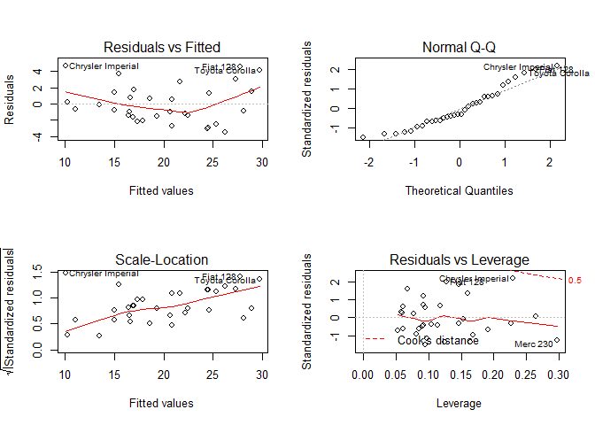

# Automobile industry MPG analysis
Calin Uioreanu  
October 22, 2015  

This is the course project for Regression Model Coursera Course, part of the Data Science specialization. We explore here R's **mtcars dataset** and investigate the relationship between MPG and several other car variables. 

The [mtcars dataset](https://stat.ethz.ch/R-manual/R-devel/library/datasets/html/mtcars.html) comes from the 1974 Motor Trend US magazine and contains fuel consumption and 10 aspects of automobile design and performance for automobiles (1973–74 models). Since the cars we analyse are 50 years old and the dataset contains only 32 cars, we can build nice charts and t.tests but the conclusions will most likely no longer be valid today. Our analysis focuses on these two questions:

- “Is an automatic or manual transmission better for MPG”
- "Quantify the MPG difference between automatic and manual transmissions"

For the first question, we are to investigate the 9th variable [, 9]	am	Transmission (0 = automatic, 1 = manual) impact on mpg (outcome variable). First step is graphical exploration.


## Exploring the dataset
We'll focus on exploring the relationship between Transmission (am predictor variable) and Miles per Gallon (mpg).
 

So it appears that cars with manual transmission tend to consume less fuel.


```r
# and a histogram using ggplot2
m <- ggplot(mtcars, aes(x=mpg, fill=as.factor(am)))
m + geom_density(alpha = 0.2) + ggtitle("MPG histogram grouped by transmission (0=automatic, 1 = manual)")
```

 

## Correlation matrix
Again, from the graphs alone, it appears that manual transmission tends to allow more Miles per Gallon. We'll first look at how correlated are the predictor variables in order to eliminate confounding variables, highly correlated and insignificant variables in steps. 


```r
# build correlation matrix
head(round(cor(mtcars),2), 1)
```

```
##     mpg   cyl  disp    hp drat    wt qsec   vs  am gear  carb
## mpg   1 -0.85 -0.85 -0.78 0.68 -0.87 0.42 0.66 0.6 0.48 -0.55
```

So it appears we have several highly correlated variables at the 0.7-0.8% threshold, like vs and cyl. As we further refine the model, we may have a high R-squared value but many variables are insignificant and we eliminate one at a time, rebuilding the model in the process. We'll then investigate the relationship between the outcome (mpg) and the remaining predictor variables further by using multivariate linear regression.

## Modeling

```r
# fit a complete model on all predictors
fit.multi = lm(mpg ~ ., data=mtcars)
###summary(fit.multi)

# we can therefore safely eliminate vs and cyl as insignificant (high P-value) and highly correlated
fit.multi = lm(mpg ~ . - cyl - vs, data=mtcars)
summary(fit.multi)$coefficients[,4]
```

```
## (Intercept)        disp          hp        drat          wt        qsec 
##  0.41985460  0.45897019  0.30398892  0.56300717  0.05049085  0.13194532 
##          am        gear        carb 
##  0.19282690  0.56921947  0.74695821
```

```r
# eliminate carb, drat and gear (highest p-values)
fit.multi = lm(mpg ~ . - cyl - vs - carb - gear - drat, data=mtcars)
summary(fit.multi)$coefficients[,4]
```

```
## (Intercept)        disp          hp          wt        qsec          am 
## 0.152378367 0.298972150 0.156387279 0.002075008 0.043907652 0.027487809
```

```r
# eliminate hp and disp (highest p-values), fit remaining variables
fit.multi = lm(mpg ~ wt + qsec + am, data=mtcars)
summary(fit.multi)
```

```
## 
## Call:
## lm(formula = mpg ~ wt + qsec + am, data = mtcars)
## 
## Residuals:
##     Min      1Q  Median      3Q     Max 
## -3.4811 -1.5555 -0.7257  1.4110  4.6610 
## 
## Coefficients:
##             Estimate Std. Error t value Pr(>|t|)    
## (Intercept)   9.6178     6.9596   1.382 0.177915    
## wt           -3.9165     0.7112  -5.507 6.95e-06 ***
## qsec          1.2259     0.2887   4.247 0.000216 ***
## am            2.9358     1.4109   2.081 0.046716 *  
## ---
## Signif. codes:  0 '***' 0.001 '**' 0.01 '*' 0.05 '.' 0.1 ' ' 1
## 
## Residual standard error: 2.459 on 28 degrees of freedom
## Multiple R-squared:  0.8497,	Adjusted R-squared:  0.8336 
## F-statistic: 52.75 on 3 and 28 DF,  p-value: 1.21e-11
```

```r
# plot the residuals and other variations of the final fit
par(mfrow=c(2,2))
plot(fit.multi)
```

 

## Analysis
The summary of the final model shows all predictor variables as significant under a p-value of 0.5. The residuals vs Fitted plot shows a slight heteroscedascity, as the spread of the residuals is increasing as the fitted values change (lower side of the plot), so this suggests that there are variables that we missed in building our model. However the residual plot alone shows no pattern at all, the Cook's distance is pretty healthy so the fitted linear model is a reasonable fit. 


```r
# build the confidence intervals for the "am" predictor
confint(fit.multi, "am")
```

```
##         2.5 %   97.5 %
## am 0.04573031 5.825944
```

## Conclusions
Therefore we can conclude that a change of one unit in the predictor variable **"am"** leads to an increase of 2.9358 in the outcome variable MpG. The am variable has the values automatic = 0 and manual = 1, so **cars with automatic transmission  tend to drive 2.94 miles more per Gallon** (more precisely between 0.05 and 5.83 mpg with 95% confidence) if all other predictor variables are kept constant (Weight and qsec 1/4 mile time). The null hypothesis being that the am has a slope of 0 or has no predictive power in regards to the outcome mpg can be therefore safely rejected. The fitted model has a R-squared of 0.85 so it explains 85% of the variance in mpg if we consider the  both weight, transmission and 1/4 mile time. 
